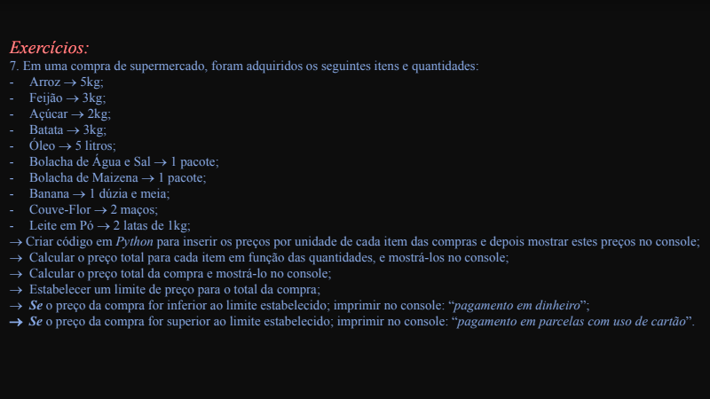

# att-var7
Exemplo de média de notas em Python

## From
Faculdade de Ciência de Dados.

Matéria: ICD002 Algoritmos e Introdução à Computação

Apostila: Atualização de variáveis + condicionais if e if else - IV

## Environment
Feito em NixOS, spyder.

## Enunciado

